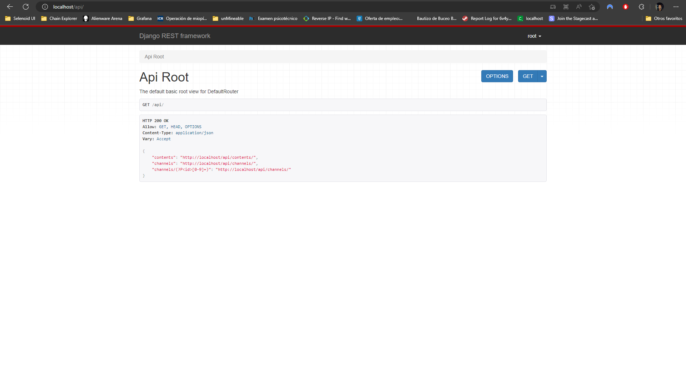

# DevOps Challenge


## Rquirements
* Docker

## Start Everything

To start everything we just have to execute the docker-compose command, like so:
```shell
$ docker-compose up -d
[+] Running 3/3
 ⠿ Network immfly_default       Created                 0.0s
 ⠿ Container immfly-django-api  Started                 0.4s
 ⠿ Container immfly-prod        Started                 0.6s
```

## View the API

To view the API, please access port `80` on your browser.

```HTTP
GET http://localhost/api/
```



## Admin User

Here is the default super user that was created:

```
username: root
password: toor
```

## Endpoints

There are two different endpoints

* channels/
* contents/

### Channels

A request to `channels` will return all the top level channels, meaning the channels without any parent channels.

```shell
$ curl -s http://localhost/api/channels/ | jq
[
  {
    "id": 1,
    "title": "Audible",
    "picture": "https://upload.wikimedia.org/wikipedia/commons/d/d2/Audible_logo.svg"
  },
  {
    "id": 2,
    "title": "Movies",
    "picture": "https://www.nicepng.com/png/full/356-3565814_png-file-movie-icon-vector-png.png"
  },
  {
    "id": 3,
    "title": "TV Shows",
    "picture": null
  },
  {
    "id": 4,
    "title": "Lifestyle",
    "picture": null
  },
  {
    "id": 5,
    "title": "Music & Podcasts",
    "picture": null
  },
  {
    "id": 6,
    "title": "Kids",
    "picture": null
  },
  {
    "id": 7,
    "title": "Press & Magazines",
    "picture": null
  },
  {
    "id": 8,
    "title": "Games",
    "picture": null
  }
]
```

A request to `channels/<id>` will show the data of the channel aswell as it's subchannels incase it has some else show content.

<details>
  <summary>Request to channel without any channels or content.</summary>

  ```shell
  $ curl -s http://localhost/api/channels/1/ | jq
  [
    {
      "id": 1,
      "title": "Audible",
      "language": [
        {
          "id": 1,
          "name": "English",
          "code": "en"
        },
        {
          "id": 2,
          "name": "Spanish",
          "code": "es"
        },
        {
          "id": 3,
          "name": "Portuguese",
          "code": "pt"
        }
      ],
      "picture": "https://upload.wikimedia.org/wikipedia/commons/d/d2/Audible_logo.svg",
      "type": null,
      "content": [],
      "channels": []
    }
  ]
  ```
</details>

<details>
  <summary>Request with subchannels and content</summary>

  ```shell
  $ curl -s http://localhost/api/channels/3/ | jq
  [
    {
      "id": 3,
      "title": "TV Shows",
      "language": [
        {
          "id": 1,
          "name": "English",
          "code": "en"
        },
        {
          "id": 2,
          "name": "Spanish",
          "code": "es"
        },
        {
          "id": 3,
          "name": "Portuguese",
          "code": "pt"
        }
      ],
      "picture": null,
      "type": null,
      "content": [],
      "channels": [
        {
          "id": 9,
          "title": "Vikings",
          "picture": "https://m.media-amazon.com/images/M/MV5BNzk4ZGIwOTAtZTFmYi00YWIyLThhODItMjFjZTk5NDQzMzNkXkEyXkFqcGdeQXVyMTkxNjUyNQ@@._V1_FMjpg_UX844_.jpg"
        }
      ]
    }
  ]
  ```
</details>

<details>
  <summary>Request with no subcannels but with content</summary>

  ```shell
  $ curl -s http://localhost/api/channels/9/ | jq
  [
    {
      "id": 9,
      "title": "Vikings",
      "language": [
        {
          "id": 1,
          "name": "English",
          "code": "en"
        },
        {
          "id": 2,
          "name": "Spanish",
          "code": "es"
        },
        {
          "id": 3,
          "name": "Portuguese",
          "code": "pt"
        }
      ],
      "picture": "https://m.media-amazon.com/images/M/MV5BNzk4ZGIwOTAtZTFmYi00YWIyLThhODItMjFjZTk5NDQzMzNkXkEyXkFqcGdeQXVyMTkxNjUyNQ@@._V1_FMjpg_UX844_.jpg",
      "type": {
        "id": 1,
        "name": "TV Series"
      },
      "content": [
        {
          "id": 1,
          "title": "S1:E1 Rites of Passage",
          "description": "Ragnar goes on a trip of initiation with his son. Meanwhile, he thinks he has finally found a way to sail ships to the west. However, his beliefs are seen as insane so he chooses to go against the law.",
          "rating": "7.60",
          "age_rating": "12+",
          "picture": "https://m.media-amazon.com/images/M/MV5BZGY5YTZkNWQtZTA5OS00MWY0LWE5Y2YtMzgyNGU0NmFlYTQ1XkEyXkFqcGdeQXVyMzY1MjY1NTY@._V1_UY126_CR0,0,224,126_AL_.jpg",
          "type": {
            "id": 1,
            "name": "Video"
          },
          "channel": {
            "id": 9,
            "title": "Vikings",
            "picture": "https://m.media-amazon.com/images/M/MV5BNzk4ZGIwOTAtZTFmYi00YWIyLThhODItMjFjZTk5NDQzMzNkXkEyXkFqcGdeQXVyMTkxNjUyNQ@@._V1_FMjpg_UX844_.jpg",
            "parent": {
              "id": 3,
              "title": "TV Shows",
              "picture": null,
              "parent": null,
              "type": null,
              "language": [
                1,
                2,
                3
              ]
            },
            "type": {
              "id": 1,
              "name": "TV Series"
            },
            "language": [
              {
                "id": 1,
                "name": "English",
                "code": "en"
              },
              {
                "id": 2,
                "name": "Spanish",
                "code": "es"
              },
              {
                "id": 3,
                "name": "Portuguese",
                "code": "pt"
              }
            ]
          },
          "authors": [
            {
              "id": 1,
              "name": "Michael Hirst",
              "picture": "https://m.media-amazon.com/images/M/MV5BMTU1MzA4NzcyM15BMl5BanBnXkFtZTgwODkyMDcyMTE@._V1_.jpg"
            }
          ],
          "genre": [
            {
              "id": 1,
              "name": "Action"
            },
            {
              "id": 2,
              "name": "Adventure"
            },
            {
              "id": 3,
              "name": "Drama"
            }
          ],
          "audio_languages": [
            {
              "id": 1,
              "name": "English",
              "code": "en"
            },
            {
              "id": 2,
              "name": "Spanish",
              "code": "es"
            },
            {
              "id": 3,
              "name": "Portuguese",
              "code": "pt"
            }
          ],
          "subtitle_languages": [
            {
              "id": 2,
              "name": "Spanish",
              "code": "es"
            },
            {
              "id": 3,
              "name": "Portuguese",
              "code": "pt"
            }
          ]
        },
        {
          "id": 2,
          "title": "S1:E2 Wrath of the Northmen",
          "description": "The stage is set for the first journey west by Ragnar Lothbrok as he gathers a crew willing to risk their lives to travel into the unknown.",
          "rating": "7.80",
          "age_rating": "12+",
          "picture": "https://m.media-amazon.com/images/M/MV5BMjI4NTk2MTAyNF5BMl5BanBnXkFtZTcwNDg3MDIyOQ@@._V1_UX224_CR0,0,224,126_AL_.jpg",
          "type": {
            "id": 1,
            "name": "Video"
          },
          "channel": {
            "id": 9,
            "title": "Vikings",
            "picture": "https://m.media-amazon.com/images/M/MV5BNzk4ZGIwOTAtZTFmYi00YWIyLThhODItMjFjZTk5NDQzMzNkXkEyXkFqcGdeQXVyMTkxNjUyNQ@@._V1_FMjpg_UX844_.jpg",
            "parent": {
              "id": 3,
              "title": "TV Shows",
              "picture": null,
              "parent": null,
              "type": null,
              "language": [
                1,
                2,
                3
              ]
            },
            "type": {
              "id": 1,
              "name": "TV Series"
            },
            "language": [
              {
                "id": 1,
                "name": "English",
                "code": "en"
              },
              {
                "id": 2,
                "name": "Spanish",
                "code": "es"
              },
              {
                "id": 3,
                "name": "Portuguese",
                "code": "pt"
              }
            ]
          },
          "authors": [
            {
              "id": 1,
              "name": "Michael Hirst",
              "picture": "https://m.media-amazon.com/images/M/MV5BMTU1MzA4NzcyM15BMl5BanBnXkFtZTgwODkyMDcyMTE@._V1_.jpg"
            }
          ],
          "genre": [
            {
              "id": 1,
              "name": "Action"
            },
            {
              "id": 2,
              "name": "Adventure"
            },
            {
              "id": 3,
              "name": "Drama"
            }
          ],
          "audio_languages": [
            {
              "id": 2,
              "name": "Spanish",
              "code": "es"
            },
            {
              "id": 3,
              "name": "Portuguese",
              "code": "pt"
            }
          ],
          "subtitle_languages": [
            {
              "id": 1,
              "name": "English",
              "code": "en"
            },
            {
              "id": 2,
              "name": "Spanish",
              "code": "es"
            },
            {
              "id": 3,
              "name": "Portuguese",
              "code": "pt"
            }
          ]
        }
      ],
      "channels": []
    }
  ]
  ```
</details>

### Content

A request to `contents` will show all the contents. And if `id` is specified it will show the content belonging to that specific id.

```shell
$ curl -s http://localhost/api/contents/1/ | jq
{
  "id": 1,
  "title": "S1:E1 Rites of Passage",
  "description": "Ragnar goes on a trip of initiation with his son. Meanwhile, he thinks he has finally found a way to sail ships to the west. However, his beliefs are seen as insane so he chooses to go against the law.",
  "rating": "7.60",
  "age_rating": "12+",
  "picture": "https://m.media-amazon.com/images/M/MV5BZGY5YTZkNWQtZTA5OS00MWY0LWE5Y2YtMzgyNGU0NmFlYTQ1XkEyXkFqcGdeQXVyMzY1MjY1NTY@._V1_UY126_CR0,0,224,126_AL_.jpg",
  "type": {
    "id": 1,
    "name": "Video"
  },
  "channel": {
    "id": 9,
    "title": "Vikings",
    "picture": "https://m.media-amazon.com/images/M/MV5BNzk4ZGIwOTAtZTFmYi00YWIyLThhODItMjFjZTk5NDQzMzNkXkEyXkFqcGdeQXVyMTkxNjUyNQ@@._V1_FMjpg_UX844_.jpg",
    "parent": {
      "id": 3,
      "title": "TV Shows",
      "picture": null,
      "parent": null,
      "type": null,
      "language": [
        1,
        2,
        3
      ]
    },
    "type": {
      "id": 1,
      "name": "TV Series"
    },
    "language": [
      {
        "id": 1,
        "name": "English",
        "code": "en"
      },
      {
        "id": 2,
        "name": "Spanish",
        "code": "es"
      },
      {
        "id": 3,
        "name": "Portuguese",
        "code": "pt"
      }
    ]
  },
  "authors": [
    {
      "id": 1,
      "name": "Michael Hirst",
      "picture": "https://m.media-amazon.com/images/M/MV5BMTU1MzA4NzcyM15BMl5BanBnXkFtZTgwODkyMDcyMTE@._V1_.jpg"
    }
  ],
  "genre": [
    {
      "id": 1,
      "name": "Action"
    },
    {
      "id": 2,
      "name": "Adventure"
    },
    {
      "id": 3,
      "name": "Drama"
    }
  ],
  "audio_languages": [
    {
      "id": 1,
      "name": "English",
      "code": "en"
    },
    {
      "id": 2,
      "name": "Spanish",
      "code": "es"
    },
    {
      "id": 3,
      "name": "Portuguese",
      "code": "pt"
    }
  ],
  "subtitle_languages": [
    {
      "id": 2,
      "name": "Spanish",
      "code": "es"
    },
    {
      "id": 3,
      "name": "Portuguese",
      "code": "pt"
    }
  ]
}
```

## Rating Calculator

To run a rating calculator, execute this command:

```shell
$  docker exec immfly-django-api python manage.py calculateRating
Ratings calculated in 0.02 seconds
```

This will generate a file named `ratings_<timestamp>.csv` inside the `api` folder, and it looks something like this:

```csv
Channel Title,Rating
TV Shows,7.70
Vikings,7.70
Audible,0.00
Movies,0.00
Lifestyle,0.00
Music & Podcasts,0.00
Kids,0.00
Press & Magazines,0.00
Games,0.00
```

There are no unit test for this algorithm, because me being tight on time so I ended up creating a function without returns, which is not possible to test with unit tests.